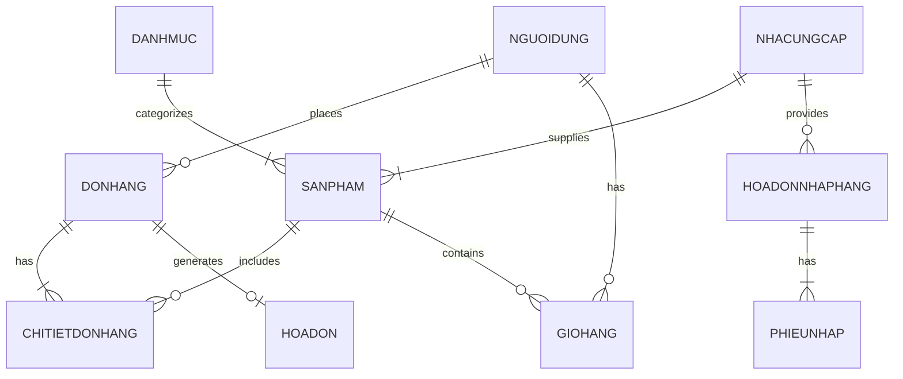

# 📦 Phone Sales System (Electronic Warehouse Management)


## 📖 Our Story

Imagine running a bustling mobile phone store. Every day, you face dozens of orders, hundreds of inventory imports and exports, and relentless customer support needs. Manual bookkeeping or disjointed Excel files quickly become a "nightmare" when your warehouse experiences stock discrepancies or lost inventory. 

That is exactly why **Phone Sales System (QL_Kho)** was born! It is not just an ordinary e-commerce website; it is a **comprehensive electronic warehouse management solution**. It seamlessly bridges the smooth, intuitive shopping experience for customers (Front-end) with the strict, absolute control required by store managers (Back-end & Database). From the moment a customer clicks "Add to Cart" to the second the product leaves the warehouse, every single piece of data is tracked, controlled, and reported in real-time.

---

## 📌 System Description

**Phone Sales System** is a Multi-tier Architecture web application developed on the **ASP.NET MVC 5** framework and **Entity Framework**. 

The system implements a robust relational database model using **SQL Server**, fully utilizing advanced database features such as *Stored Procedures*, *Triggers*, and *Functions*. This ensures that complex business logic is handled directly at the data tier, guaranteeing data integrity, consistency, and high performance even when dealing with large transaction volumes. 

The user interface is lean, responsive, and user-friendly, built with **HTML/CSS/JS** and **Bootstrap 5**, providing an optimal shopping experience across desktop, tablet, and mobile devices.

---

## ✨ Highlighted Features

The system is designed to solve two major challenges: **Online Sales** and **Inventory Management**.

### 🛍️ For Customers (Shopping Experience)
- **Smart Search & Filter:** Quickly find the perfect smartphone by specifications, price range, or brand category.
- **One-touch Cart & Checkout:** A seamless checkout experience with real-time order status tracking.
- **Real-time Interaction:** Get instant support via the integrated Chatbox and catch the latest hot deals through promotional Popups.
- **User Dashboard:** Manage personal profiles, view order history, and securely change passwords.

### 🛡️ For Administrators (Management & Inventory)
- **Automated Low Stock Alert:** The system automatically detects and alerts managers when product inventory falls below a safe threshold.
- **Order Lifecycle Management:** Track orders seamlessly from *Pending -> Processing -> Shipping -> Delivered*.
- **Audit Logging (Security Log):** Every sensitive data modification is tracked by the system (Who changed it? When was it changed?) to prevent data loss and internal fraud.
- **Visual Statistics Dashboard:** Provides a comprehensive overview of daily/monthly/yearly revenue and best-selling products.

---

## 🔄 Core Business Flow

> **The system bridges the gap between customer actions and warehouse operations through a seamless business flow:**

1. **Browsing & Discovery:** Customers visit the store, filter products by categories or brands, and view detailed phone specifications.
2. **Cart Management & Checkout:** Customers add desired items to their shopping cart and proceed to checkout, generating a new *Pending Order* (`DONHANG`).
3. **Order Processing (Admin):** Store administrators review the *Pending Order* via the Admin Dashboard. Upon confirmation, the order status changes to *Processing/Shipping*.
4. **Inventory Deduction & Fulfillment:** A database transaction is triggered. The system automatically deducts the purchased quantity from the warehouse inventory (`SANPHAM`). If stock falls below a predefined threshold, an automated *Low Stock Alert* is generated.
5. **Shipping & Delivery:** Once the order is dispatched and delivered, the status is updated to *Completed*. The system automatically logs the revenue and generates a Sales Invoice (`HOADON`).
6. **Restocking (Warehouse):** When inventory runs low, the Admin creates an Import Invoice (`HOADONNHAPHANG`) from suppliers. Upon arrival, the system updates the inventory levels, completing the product lifecycle.

---

## 📊 ERD (Entity-Relationship Diagram)

This diagram illustrates the relationships between the core entities in the sales and inventory management system.



---

## 🧾 Database Tables

The system uses the `DT_DB` database, which is strictly designed and standardized:

| Table Name | Description |
| :--- | :--- |
| **`NGUOIDUNG`** | Manages user accounts (Customers, Admins, Managers) and authentication. |
| **`SANPHAM`** | Stores phone details, current stock quantities, and pricing. |
| **`DANHMUC`** | Categorizes products by brands or phone series. |
| **`NHACUNGCAP`** | Information about distributors and goods suppliers. |
| **`GIOHANG`** | Stores items that customers currently intend to purchase. |
| **`DONHANG`** | General order information (Order Status, Total Amount, Shipping Details). |
| **`CHITIETDONHANG`**| Specific items, quantities, and prices within a specific order. |
| **`HOADON`** | Official sales invoices issued to customers upon order completion. |
| **`CTHOADON`** | Detailed line items for the sales invoices. |
| **`HOADONNHAPHANG`**| Import records for restocking inventory from suppliers. |
| **`PHIEUNHAP`** | Specific product details, imported quantities, and cost prices for each import. |
| **`AUDITLOG`** | Security audit trail, automatically logging crucial changes via SQL Triggers. |
| **`BACKUP_HISTORY`**| History logs of routine database backups. |

---

## ⚙️ Database Setup (How to run SQL)

To ensure the application functions correctly, you must set up the database before running the code. The system has packaged all Stored Procedures, Triggers, and mock data into a single SQL Script.

**Execution Steps:**
1. Open **SQL Server Management Studio (SSMS)** and connect to your local or remote SQL Server.
2. Open the prepared script file located at: `Database/QL_KHOScrip.sql`.
3. Press **F5** (or click **Execute**) to run the entire script.
   * *This script will automatically check and create the `DT_DB` database, build all tables and relationships, insert mock data, and initialize all necessary Stored Procedures, Functions, and Triggers.*
4. Open the `Web.config` file in the `QL_Kho` project directory.
5. Update the `connectionString` to point to your SQL Server (Replace `YOUR_SERVER`, `YOUR_USER`, and `YOUR_PASSWORD`):
   ```xml
   <connectionStrings>
       <add name="Model1" 
            connectionString="data source=YOUR_SERVER;initial catalog=DT_DB;user id=YOUR_USER;password=YOUR_PASSWORD;TrustServerCertificate=True;MultipleActiveResultSets=True;App=EntityFramework" 
            providerName="System.Data.SqlClient" />
   </connectionStrings>
   ```

---

## 📥 Installation Guide

1. **Clone the repository:**
   ```bash
   git clone https://github.com/HoaiNam2k5/DA_HCSDL.git
   cd DA_HCSDL
   ```
2. **Setup the Database:** Follow the instructions in the **⚙️ Database Setup** section above.
3. **Open the Project:** Open the `QL_Kho.sln` solution file using **Visual Studio 2022**.
4. **Restore Packages:** Go to `Tools > NuGet Package Manager > Package Manager Console` and run the command: 
   ```powershell
   Update-Package -reinstall
   ```
5. **Run the Application:** Press `Ctrl + F5` or click the Run button in Visual Studio to launch the system!

---

## 👥 Author

- **HoaiNam2k5** - *Database Design & Fullstack Development* - [GitHub Profile](https://github.com/HoaiNam2k5)

<div align="center">
  <p>⭐ If you find this project helpful or interesting, please consider giving it a Star! ⭐</p>
  <p>Made with ❤️ by HoaiNam2k5 for Database Management Systems</p>
</div>
